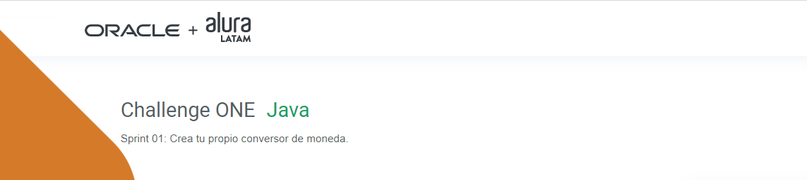

 
   
   
   

---

## Descripción
#### El objetivo de este quinto challenge es poner en práctica los conceptos aprendidos sobre Java en la ruta Back-End del programa **ONE**.
---
&nbsp;

## Funcionalidad
  
 El proyecto consiste en una aplicación de escritorio con las funcionalidades de conversión de divisas y temperaturas.

# Conversor
Challenge Alura Conversor de Monedas

FUNCIONALIDADES:

*Conversor de Divisas (CLP, USD, EUR, GBP, JPY, KRW, ARS)*

*Conversor de Temperatura (Celsius, Fahernheit, Kelvin)*

Challenge Alura de conversor de monedas.
Este proyecto fue realizado en JAVA utilizando la parte grafica (Button´s, text field´s, y, label´s). Permite la conversion de las divisas ya mencionadas,
como tambien de las temperaturas.

No permite el ingreso de letras en las casillas de jTextField. 

---
## Tecnologías utilizadas

